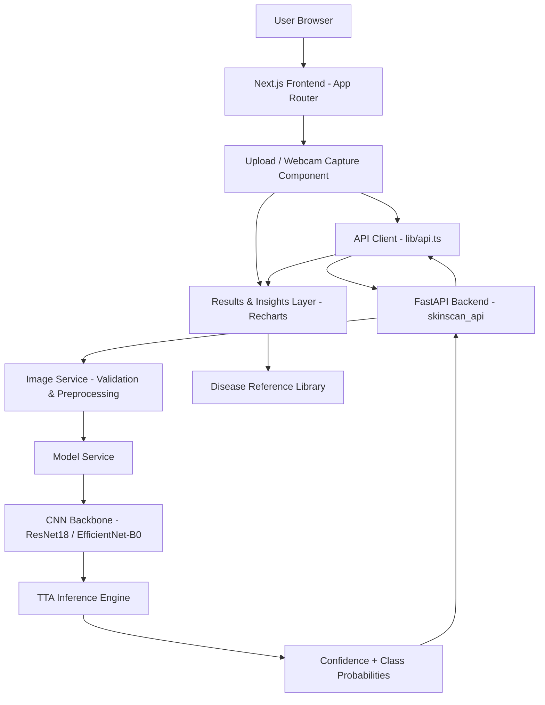
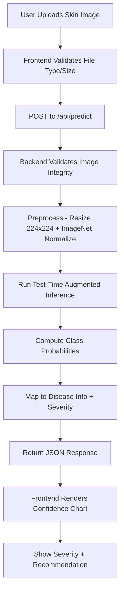
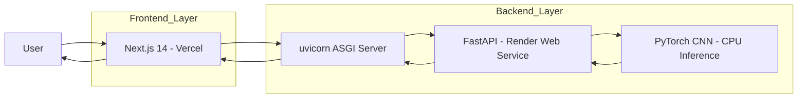
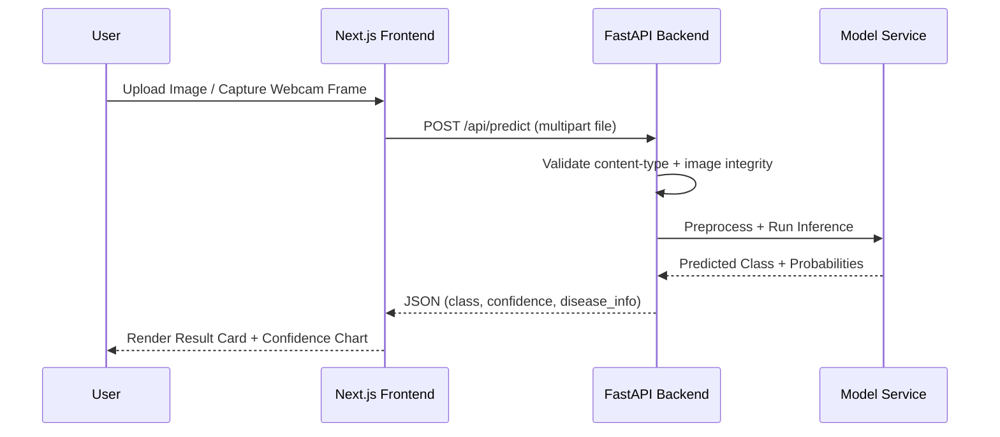

  

  <b>🩺 Instant Skin Condition Screening — Upload a Photo, Get AI-Backed Insights</b>

  
  
  
  
  

  

---

## 📌 Overview

**SkinScan-AI** is a full-stack, AI-assisted skin disease classification platform rebuilt from an original Streamlit prototype into a production-style medical-tech demo.

Skin conditions are among the most commonly self-diagnosed (and misdiagnosed) health issues — many people delay seeing a dermatologist simply because they don't know if a mark on their skin is benign or serious. SkinScan-AI lets a user upload a photo of a skin lesion and get an instant, AI-backed classification across 9 dermatological categories, complete with severity guidance, confidence scoring, and test-time-augmented inference for more reliable predictions.

The repo contains:

- `backend/` — FastAPI service (`skinscan_api`) for image validation, preprocessing, TTA inference, and disease metadata
- `frontend/` — Next.js 14 App Router UI with Tailwind CSS, Framer Motion, and Recharts
- `attached_assets/` — sample images and the default model checkpoint used by the backend
- `train_skin_disease_model.py` / `fetch_and_train.py` — training pipeline for the underlying CNN

---

## 🏗️ System Architecture

---

## 🔄 End-to-End Processing Flow

---

## ☁️ Cloud Execution Flow

---

## 🔁 Prediction Request Lifecycle

---

## 🚀 Development Status

SkinScan-AI is actively being deployed and hardened for production hosting.

Ongoing work includes:

- Deploying backend to Render and frontend to Vercel
- Resolving Docker cold-start latency on the free tier
- Improving checkpoint/architecture auto-detection robustness
- Expanding the disease reference library
- Mobile camera-capture refinements

---

## ✨ Key Features

- 🧠 AI-powered skin disease classification across 9 dermatological classes
- 📸 Image upload **and** live webcam capture support
- 🔁 Test-time augmentation (TTA) for more stable confidence scores
- 📊 Per-class probability breakdown with animated Recharts visuals
- 🩹 Severity-tiered guidance (low / moderate / high / unknown) per condition
- 🧾 PDF report export via `jsPDF`
- 🩺 Graceful **demo mode** — API stays usable even without a checkpoint file
- ⚡ Health endpoint reporting model status, architecture, and mode

---

## 🤖 Machine Learning Integration

SkinScan-AI uses a **CNN backbone (ResNet18 in training, EfficientNet-B0 in demo mode)** for 9-class skin lesion classification, with the production architecture auto-detected from the loaded checkpoint's state dict.

### ML Workflow

1. User uploads or captures a skin image
2. Backend validates format, dimensions, and integrity
3. Image is resized to 224×224 and normalized using ImageNet statistics
4. Model runs test-time-augmented inference
5. Softmax probabilities are computed per class
6. Confidence level is bucketed (`healthy` / `low` / `medium` / `high`)
7. Matching disease metadata (description, severity, recommendation) is attached

### Disease Classes Covered

| Class | Severity Level |
|---|---|
| Actinic keratosis | 🟠 Moderate |
| Atopic Dermatitis | 🟡 Low |
| Benign keratosis | 🟡 Low |
| Dermatofibroma | 🟡 Low |
| Melanocytic nevus | 🟡 Low |
| Melanoma | 🔴 High |
| Squamous cell carcinoma | 🔴 High |
| Tinea Ringworm Candidiasis | 🟡 Low |
| Vascular lesion | 🟡 Low |

---

## 📂 Project Structure
