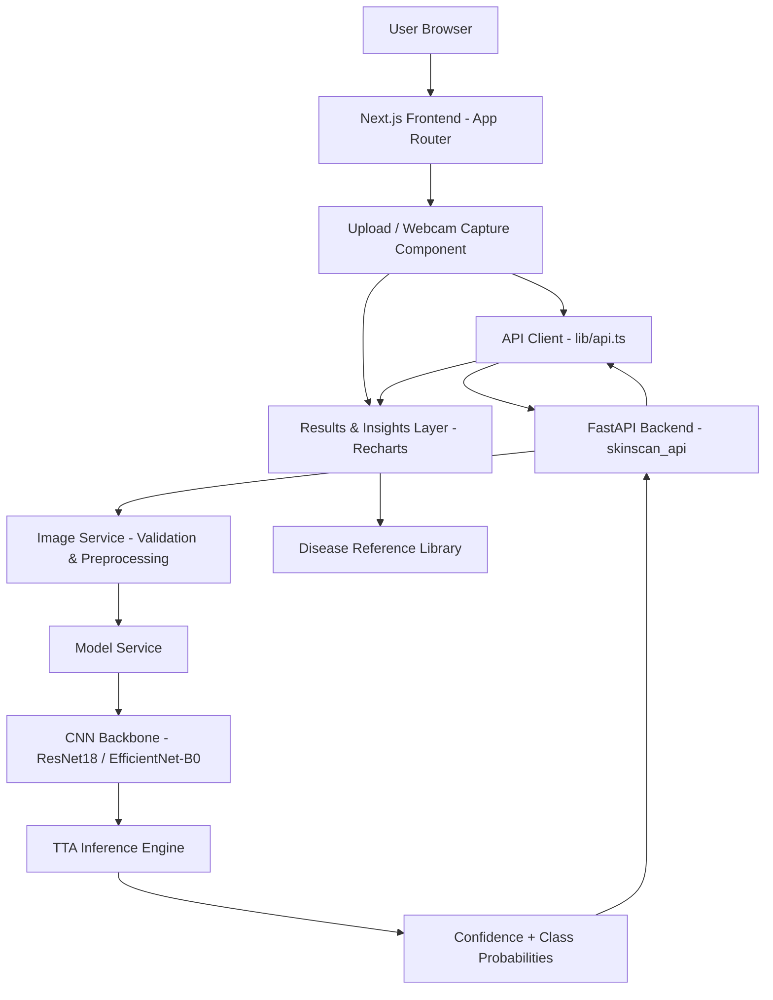
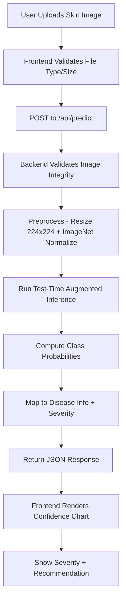
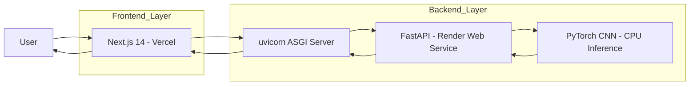
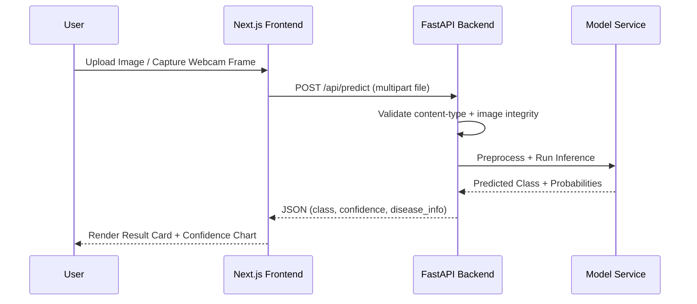

<p align="center">
  
</p>

<p align="center">
  <b>🩺 Instant Skin Condition Screening — Upload a Photo, Get AI-Backed Insights</b>
</p>

<p align="center">
  
  
  
  
  
</p>

<p align="center">
  <a href="https://ravish4nkar.vercel.app" target="_blank">
    
  </a>
</p>

---

## 📌 Overview

**SkinScan-AI** is a full-stack, AI-assisted skin disease classification platform rebuilt from an original Streamlit prototype into a production-style medical-tech demo.

Skin conditions are among the most commonly self-diagnosed (and misdiagnosed) health issues — many people delay seeing a dermatologist simply because they don't know if a mark on their skin is benign or serious. SkinScan-AI lets a user upload a photo of a skin lesion and get an instant, AI-backed classification across 9 dermatological categories, complete with severity guidance, confidence scoring, and test-time-augmented inference for more reliable predictions.

The repo contains:

- `backend/` — FastAPI service (`skinscan_api`) for image validation, preprocessing, TTA inference, and disease metadata
- `frontend/` — Next.js 14 App Router UI with Tailwind CSS, Framer Motion, and Recharts
- `attached_assets/` — sample images and the default model checkpoint used by the backend
- `train_skin_disease_model.py` / `fetch_and_train.py` — training pipeline for the underlying CNN

---

## 🏗️ System Architecture



---

## 🔄 End-to-End Processing Flow



---

## ☁️ Cloud Execution Flow



---

## 🔁 Prediction Request Lifecycle



---

## 🚀 Development Status

SkinScan-AI is actively being deployed and hardened for production hosting.

Ongoing work includes:

- Deploying backend to Render and frontend to Vercel
- Resolving Docker cold-start latency on the free tier
- Improving checkpoint/architecture auto-detection robustness
- Expanding the disease reference library
- Mobile camera-capture refinements

---

## ✨ Key Features

- 🧠 AI-powered skin disease classification across 9 dermatological classes
- 📸 Image upload **and** live webcam capture support
- 🔁 Test-time augmentation (TTA) for more stable confidence scores
- 📊 Per-class probability breakdown with animated Recharts visuals
- 🩹 Severity-tiered guidance (low / moderate / high / unknown) per condition
- 🧾 PDF report export via `jsPDF`
- 🩺 Graceful **demo mode** — API stays usable even without a checkpoint file
- ⚡ Health endpoint reporting model status, architecture, and mode

---

## 🤖 Machine Learning Integration

SkinScan-AI uses a **CNN backbone (ResNet18 in training, EfficientNet-B0 in demo mode)** for 9-class skin lesion classification, with the production architecture auto-detected from the loaded checkpoint's state dict.

### ML Workflow

1. User uploads or captures a skin image
2. Backend validates format, dimensions, and integrity
3. Image is resized to 224×224 and normalized using ImageNet statistics
4. Model runs test-time-augmented inference
5. Softmax probabilities are computed per class
6. Confidence level is bucketed (`healthy` / `low` / `medium` / `high`)
7. Matching disease metadata (description, severity, recommendation) is attached

### Disease Classes Covered

| Class | Severity Level |
|---|---|
| Actinic keratosis | 🟠 Moderate |
| Atopic Dermatitis | 🟡 Low |
| Benign keratosis | 🟡 Low |
| Dermatofibroma | 🟡 Low |
| Melanocytic nevus | 🟡 Low |
| Melanoma | 🔴 High |
| Squamous cell carcinoma | 🔴 High |
| Tinea Ringworm Candidiasis | 🟡 Low |
| Vascular lesion | 🟡 Low |

---

## 📂 Project Structure
SkinScan-AI/
│
├── backend/
│   ├── skinscan_api/
│   │   ├── main.py             # FastAPI app entrypoint
│   │   ├── routes.py           # /api/health, /api/classes, /api/predict
│   │   ├── services.py         # Preprocessing, TTA inference, disease map
│   │   ├── schemas.py          # Pydantic response models
│   │   └── config.py           # Settings (model path, CORS origin, demo flag)
│   ├── attached_assets/        # Model checkpoint (.pth) + metadata (.json)
│   ├── requirements.txt
│   └── Dockerfile
│
├── frontend/
│   ├── app/
│   │   ├── page.tsx             # Upload + results landing page
│   │   ├── about/page.tsx
│   │   └── conditions/page.tsx  # Disease reference library
│   ├── components/
│   │   ├── upload.tsx
│   │   ├── results.tsx
│   │   ├── library.tsx
│   │   ├── model.tsx
│   │   └── navbar.tsx / footer.tsx
│   ├── lib/
│   │   ├── api.ts               # Axios/fetch client
│   │   ├── data.ts
│   │   └── types.ts
│   ├── package.json
│   └── Dockerfile
│
├── attached_assets/             # Root-level sample checkpoint (Streamlit legacy)
├── train_skin_disease_model.py  # CNN training pipeline
├── fetch_and_train.py
├── image_processor.py           # Legacy Streamlit preprocessing
├── model_utils.py               # Legacy Streamlit model loading
├── app.py                       # Legacy Streamlit entrypoint
├── docker-compose.yml
├── requirements.txt
└── README.md

---

## 🔐 Environment Variables

Frontend (`frontend/.env.local`):
NEXT_PUBLIC_API_URL=http://localhost:8000

Backend (set in Render dashboard or shell):
SKINSCAN_MODEL_PATH=attached_assets/skin_disease_model_1755756972916.pth
SKINSCAN_FRONTEND_ORIGIN=http://localhost:3000
SKINSCAN_ALLOW_DEMO_MODEL=true

---

## ⚙️ Installation & Local Setup

```bash
# Clone the repository
git clone https://github.com/shanky-ux/SkinScan-AI.git
cd SkinScan-AI

# Setup Backend
cd backend
pip install -r requirements.txt
uvicorn skinscan_api.main:app --reload --port 8000
# API runs at http://localhost:8000

# Setup Frontend (new terminal)
cd frontend
npm install
npm run dev
# Frontend runs at http://localhost:3000
```

### Or run both with Docker Compose

```bash
docker compose up --build
```

That exposes the frontend at `http://localhost:3000` and the backend at `http://localhost:8000`.

---

## 🚀 Deployment

| Service | Platform | Notes |
|---|---|---|
| 🔌 Backend (FastAPI) | Render Web Service | `Dockerfile` in `backend/`, exposes port 8000 |
| 🖥️ Frontend (Next.js) | Vercel | Set `NEXT_PUBLIC_API_URL` to the Render backend URL |
| 🗄️ Model Checkpoint | Bundled in image (`attached_assets/`) | Falls back to demo mode if missing |

**Render Settings:**
- Root Directory: `backend`
- Dockerfile Path: `backend/Dockerfile`
- Start Command: handled by `Dockerfile` (`uvicorn skinscan_api.main:app --host 0.0.0.0 --port 8000`)

**Vercel Settings:**
- Root Directory: `frontend`
- Build Command: `next build`
- Environment Variable: `NEXT_PUBLIC_API_URL=<render-backend-url>`

---

## 🔌 Key API Endpoints

| Endpoint | Method | Description |
|---|---|---|
| `/api/health` | GET | Model status, mode (checkpoint/demo), architecture, class count |
| `/api/classes` | GET | List all 9 disease classes with reference metadata |
| `/api/predict` | POST | Upload a skin image, receive prediction + confidence + guidance |

---

## 🎯 Why This Project Stands Out

- Real-world healthcare-adjacent problem with a working end-to-end AI pipeline
- Migrated from a Streamlit prototype to a decoupled Next.js + FastAPI production architecture
- Graceful demo-mode fallback keeps the app usable even without a trained checkpoint
- Clean separation of concerns: services, schemas, routes on the backend; components, lib, app router on the frontend
- Fully containerized with Docker Compose for one-command local spin-up

---

## 👨‍💻 Author

**Ravi Shankar (Shanky)**
B.Tech Computer Science (AIML)
Full Stack Developer | AI/ML Enthusiast

GitHub: https://github.com/shanky-ux
Portfolio: https://ravish4nkar.vercel.app

---

## 📜 License

This project is licensed under the MIT License — built for educational and demonstration purposes.

---

<p align="center">
  
</p>

<p align="center">
  <a href="https://ravish4nkar.vercel.app">🌐 Portfolio</a> &nbsp;|&nbsp;
  <a href="https://github.com/shanky-ux/SkinScan-AI">⭐ Star this Repo</a>
</p>

<p align="center"><i>"AI can't replace a dermatologist — but it can help someone decide whether to book that appointment sooner."</i></p>
