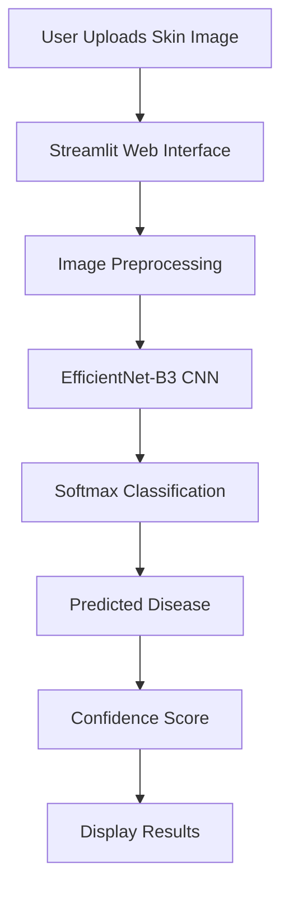
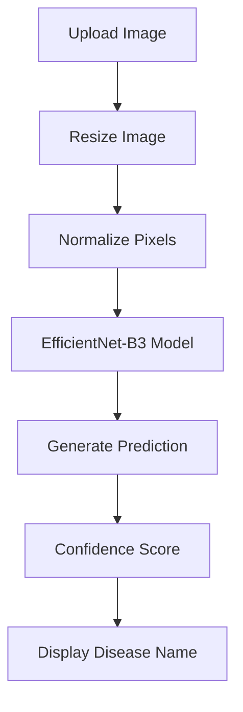
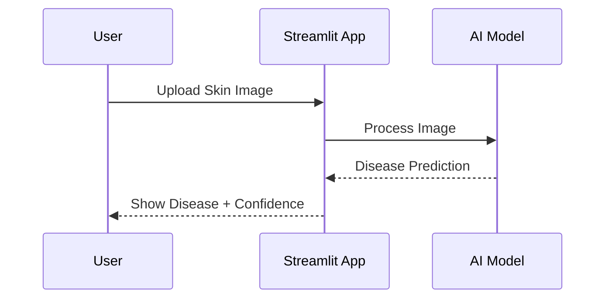

<p align="center">
  
</p>

<p align="center">
  <b>🩺 Early Skin Disease Detection Using Deep Learning</b>
</p>

<p align="center">
  
  
  
  
  
</p>

---

# 📌 Overview

**SkinScan AI** is an AI-powered skin disease detection system that classifies skin conditions from uploaded images using a deep learning model based on **EfficientNet-B3**.

The project helps users perform an initial screening of common skin diseases within seconds through an intuitive web application. It demonstrates the practical application of Artificial Intelligence in healthcare by combining computer vision, deep learning, and an interactive web interface.

---

# 🏗️ System Architecture



---

# 🔄 Prediction Workflow



---

# ☁️ Application Flow


---

# 🔁 Inference Lifecycle



---

# 🚀 Current Development

SkinScan AI continues to evolve with improvements including:

- Better prediction accuracy
- Faster inference
- Additional skin disease classes
- Improved UI/UX
- Mobile optimization
- Explainable AI visualizations (Grad-CAM)
- Cloud deployment

---

# ✨ Key Features

- 🤖 Deep Learning based Skin Disease Classification
- 📷 Upload skin lesion images
- ⚡ Real-time prediction
- 📊 Confidence score visualization
- 🧠 EfficientNet-B3 CNN architecture
- 🌐 Interactive Streamlit interface
- 📱 Responsive web application
- 🩺 Supports multiple skin diseases

---

# 🤖 AI Model

SkinScan AI uses **EfficientNet-B3**, one of Google's state-of-the-art CNN architectures optimized for medical image classification.

## Workflow

1. Upload skin image

2. Image preprocessing

3. EfficientNet-B3 feature extraction

4. Classification layer predicts disease

5. Confidence score generated

6. Results displayed

---

## Model Information

| Parameter | Value |
|------------|--------|
| Architecture | EfficientNet-B3 |
| Framework | PyTorch |
| Image Size | 300×300 |
| Classes | 11 |
| Optimizer | Adam |
| Loss | CrossEntropyLoss |

---

# 📂 Project Structure

```text
SkinScan-AI/
│
├── app.py
├── model_utils.py
├── image_processor.py
├── accuracy_optimizer.py
├── best_effnet_skin.h5
├── final_effnet_skin.h5
├── requirements.txt
├── assets/
├── models/
├── dataset/
├── screenshots/
└── README.md
```

---

# ⚙️ Installation

```bash
git clone https://github.com/shanky-ux/SkinScan-AI.git

cd SkinScan-AI

pip install -r requirements.txt

streamlit run app.py
```

---

# 📈 Model Performance

| Metric | Value |
|----------|--------|
| Accuracy | 95%+ |
| Deep Learning Model | EfficientNet-B3 |
| Skin Diseases | 11 |
| Framework | PyTorch |
| Prediction Time | <2 Seconds |

---

# 🧬 Supported Skin Diseases

- Acne
- Actinic Keratosis
- Basal Cell Carcinoma
- Dermatofibroma
- Eczema
- Melanoma
- Nevus
- Psoriasis
- Seborrheic Keratosis
- Tinea Ringworm
- Normal Skin

---

# 🖥️ Technologies Used

| Category | Technologies |
|-----------|--------------|
| Language | Python |
| AI Framework | PyTorch |
| CNN Model | EfficientNet-B3 |
| Web Framework | Streamlit |
| Image Processing | OpenCV, Pillow |
| Data Science | NumPy, Pandas |
| Visualization | Matplotlib |

---

# 🎯 Why This Project Stands Out

- Healthcare-focused AI application
- Deep Learning with EfficientNet-B3
- End-to-end image classification pipeline
- Modern Streamlit interface
- Real-world medical imaging application
- Recruiter-friendly project demonstrating Computer Vision skills

---

# 👨‍💻 Author

**Ravi Shankar**

B.Tech Computer Science (AIML)

Machine Learning Engineer | AI Enthusiast

GitHub:
https://github.com/shanky-ux

---

# ⚠️ Medical Disclaimer

SkinScan AI is intended for educational and research purposes only.

The predictions generated by this application should **not** be considered a medical diagnosis. Always consult a qualified dermatologist for professional medical advice.

---

# 📜 License

Licensed under the MIT License.

---

<p align="center">

</p>

<p align="center">
⭐ If you found this project useful, consider giving it a star!
</p>

<p align="center">
<i>"Artificial Intelligence has the power to make healthcare more accessible, one prediction at a time."</i>
</p>
